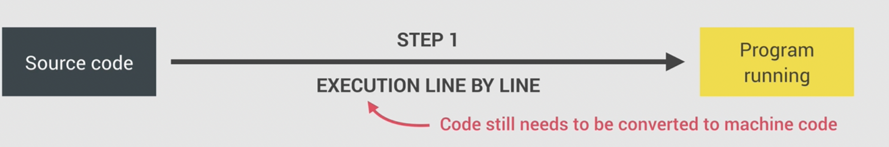
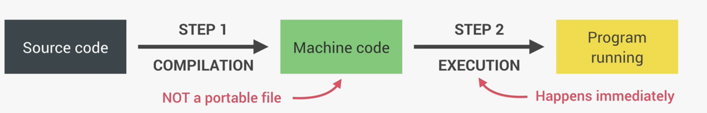
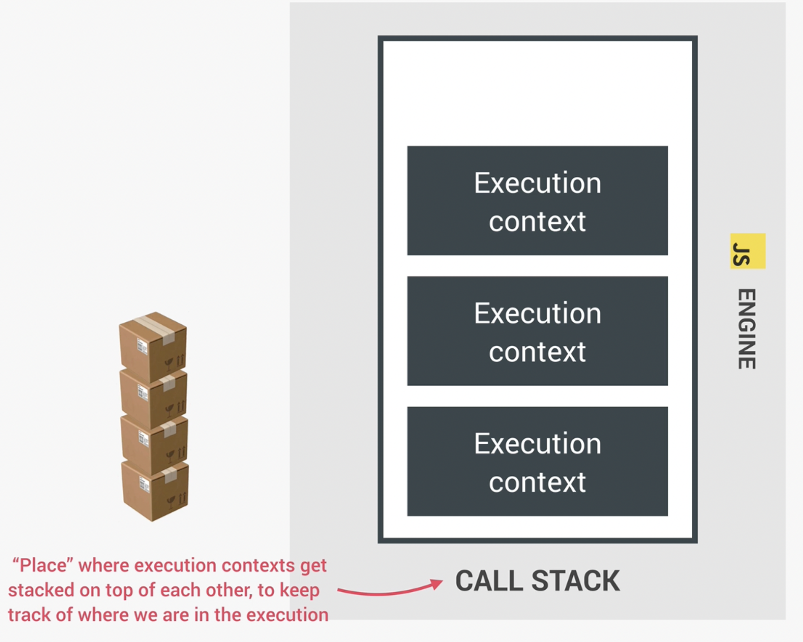

## Qué es el motor de JavaScript

El motor de Js se divide en dos grandes partes

1. Call Stack (pila de llamadas): Donde nuestro código es ejecutado

2. Heap (pila, montón): Donde se almacenan los objetos

## Compilation vs Interpretation

1. Compilation: Todo el código es transformado de forma automatica a código de maquina para que sea ejecutado.

2. Interpretador: El código sigue siendo convertido a código de maquina pero se ejecuta linea por linea.

3. Just-in-time (JIT): Combinación entre los dos anteriores donde se convierte el código fuente en código de maquina pero no se genera un archivo que se ejecuta, si no que, se ejecuta al instante después de convertir a maquina.

Esta combinación permite mejorar el rendimiento de los programa interpretaados porque compila y ejecuta. Iterando varias veces comprendiendo el contenido del código y optimizar el código.

## JavaScript Runtime

Contenido que incluye todas las cosas que necesitamos para que funcione en el navegador

HEAP, CALL STACK, WEB APIS (DOM, TIMERS, FETCH API, ...), CALLBACK QUEUE (click, timer, data, ...)

## Contexto de ejecución

La forma en que se ejecuta el código es top-level code, esto quiere decir que el código que se encuentre fuera de las funciones (primer nivel) son llamadas Globales

Luego vienen las funciones las cuales tienen un propio contexto y callback (llamada).

## ¿Qué esta dentro de un contexto de ejecución?

1. Variables de ambiente

-     Let, const y var declaration
-     Functions
-     Arguments objects

2. Scoope chain

Espacio o ambiente en donde una variable es declarada.

Ex: Global Scope, Function score y Block scope

Scope de una variable: Region de nuestro codigo donde se puede acceder a la variable.

### Global scope

Está fuera de cualquier función o bloque.

Las variables declaradas pueden ser usadas en cualquier parte.

### Function scope

Las variables solo pueden ser accesibles dentro de la función, no afuera.

También llamadas Local scope

### Block scope (ES6)

Se considera bloque todo aquello que está dentro de llaves.

Las variables solo son accesibles solo dentro del bloque

La regla anterior solo aplica en las variables declaradas con let y const.

Las funciones tienen block scope (solo en strict mode)

3. This keyword

## Qué es el Call Stack

Lugar donde se apilan los diferentes contextos uno arriba del otro, seguimiento en qué estamos en la ejecución

## Hoisting

Hace que ciertos tipos de variables sean accesibles o usables en el código antes de que sean declarados.
